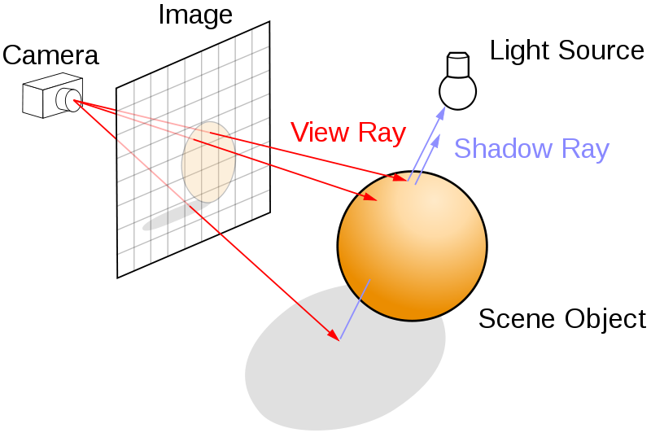

export { default as theme } from './theme'

# Cooking WebGL
### with react-three-fiber
---

### Animation technologies

- keyframes/transitions
<!-- great for simple animations) -->
- js animations (rAF or WAAPI)
<!-- (great for more complicated but less performance heavy animations, bad support for WAAPI right now) -->
- canvas
<!-- powerful but not very accessible) -->
- **WebGL**
<!-- (powerful, hardware accelerated, 3D, but hard. Or is it?)** -->

---

### WebGL

---

- Working with vertices and shaders
- **Vertex Shaders:** 
<!-- transforms code from original coordinate system to the clipspace coordinate system used by WebGL (-1, +1) and assigns it to a variable called **gl_Position** -->
- **Fragment Shaders:**
<!-- called once for every pixel for every shape to be drawn. It's job is to figure out the colour to apply to the pixel. This takes lighting, textures, etc. into account. -->
- A vertex + fragment shader together make up a **program**.

---

- Shaders need to be
  - initialised
  - compiled
  - loaded into the WebGL context

- Buffers 
<!-- need to be allocated for passing data to and from your shaders -->

- Create a perspective, bind buffers, then you can deal with attributes and positions 

---

- 3D Rendering: rendering many elements at different orrientations
<!-- cube example -->

- Animation: updating vertex positions with matrix transformations

- Lighting: involves even more matrices and complicated logic

<!-- If this is a cube could you imagine making a sphere? Or fluids movement? -->

---

### WebGL Example

---

### A lot to think about

---

### Three.js

---

- working with a scene, cameras, geometries, materials, lights
- Animation: tweaking properties of objects in your scene, and re-rendering
  - positions
  - rotations
  - colors
  - morph targets
- Math is abstracted out

---

### ThreeJS example

---

### Surely it can't get easier?

---

### Issues to address
- State: need to manage your scene state
- No handlers, interactions with objects in the scene need to use/understand raycasters

  

---

### react-three-fiber

---

- React renderer for threejs
- Uses heuristics for objects and attributes
- Handlers included
- We can now make reusable, declarative trees for our canvas!

---

### react-three-fiber example

---

### Some downsides

- Easy to write unperformant code
- Same control as three.js but it's not obvious
- Handlers don't always behave how you expect

---

- https://threejs.org/
- https://github.com/drcmda/react-three-fiber
- https://webglfundamentals.org/

---

### End